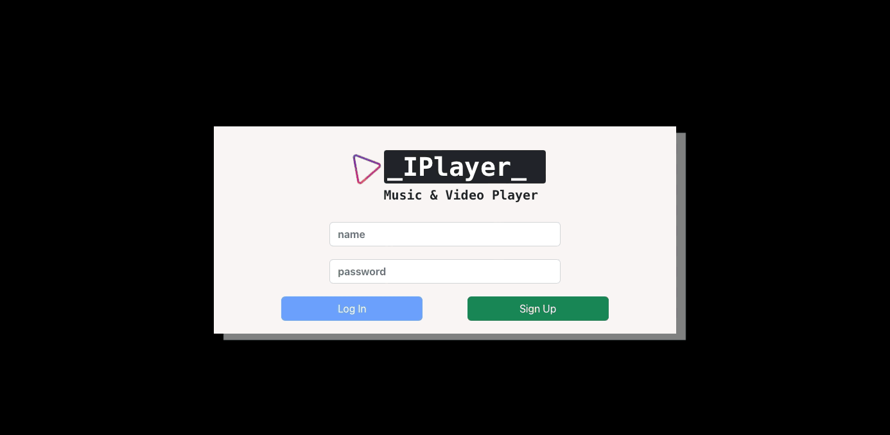

## Description:
Thanks to Itunes API a developed a free 30 seconds trial music web site. Where user can listen to any song desired. All the requests to the API were followed by the official [Itunes documentation](https://performance-partners.apple.com/search-api).

## Starting Project:
1. Cloning the repository
-  `git clone git@github.com:Vincenzofdg/IPlayer.git`
2. Enter in the directory folder
- `cd IPlayer`
3. Install projects dependencies
- `npm install` or `npm ci`
4. Starting localy
- Node Version 18: `npm start`

## Dependencies Used:
1. Styled Components (_npm install styled-components_);
2. ReactStrap and Bootstrap (_npm install react-bootstrap bootstrap_)
3. React Router (_npm install react-router-dom_)

## Deploy With GitHub Actions:
1. Create the build.yml file: `github/workflows/build.yml`;
2. Add on packge.json: `"homepage": "IPlayer/"`;
3. <details>
    <summary>Content of build.yml:</summary>

    ```
    name: deploy

    on:
      push:
        branches:
          - master

    jobs:
      deploy:
        runs-on: ubuntu-18.04
        steps:
          - uses: actions/checkout@v2
          - uses: actions/setup-node@v1
            with:
              node-version: '16.x'
          - name: Build web-app
            run: |
              npm ci
              npm run build
          - name: Deploy to gh-pages
            uses: peaceiris/actions-gh-pages@v3
            with:
              github_token: ${{ secrets.GITHUB_TOKEN }}
              publish_dir: ./build
    ```

  </details>

<br />


